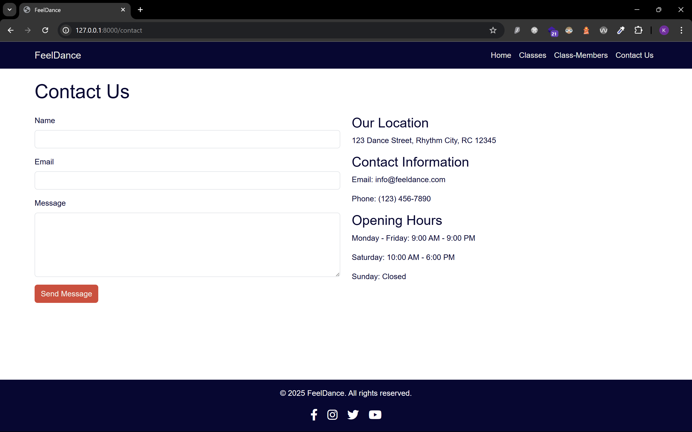

# FeelDance
## Setup

To set up this CMS follow these steps:

1. Using your Terminal (or Git Bash on Windows), navigate to your working folder:

    ```
    $ cd <FOLDER_NAME>
    $ ls
    ```

    Note: On a Wiindows machine use ```dir``` to view the files in the current folder:

    ```
    $ dir
    ```

2. Clone this repo:

    ```
    $ git clone https://github.com/ken-yksze/http5225-a3.git
    ```

3. Using the Terminal, use ```ls``` on a Mac ot ```dir``` on a Windows machine to view the files in the current directory:
    You should now see a folder named ```http5225-a3```. Change the present working directory to your new folder:

    ```
    $ cd http5225-a3
    ```

4. Using the Terminal (or Git Bash), run ```composer install```:

    ```
    $ composer install
    ```

5. We need to setup the database connection. 

    Using MAMP and phpMyAdmin, create a new databse. 

    Make a copy the ```.env.sample``` file and name it ```.env```. Update the new ```.env``` file with your database credentials:

    ```php
    DB_CONNECTION=mysql
    DB_HOST=127.0.0.1
    DB_PORT=3306
    DB_DATABASE=feeldance
    DB_USERNAME=root
    DB_PASSWORD=root
    ```

    The database setup included with this applications includes migrations and seeding. Run the following command to create the required tables and seed them with testing data:

    ```
    $ php artisan migrate
    $ php artisan migrate:refresh --seed
    ```

6. To use the ```public``` file system:
    ```
    $ php artisan storage:link
    $ cp ./public/images/instructors/* ./public/storage
    ```

## Test
```
$ php artisan serve
```

## Screenshots
### Home


### Member


### Class


### Contact


### Login


### Admin


### Admin Member


### Admin Member Create


### Admin Member Edit


### Admin Class


### Admin Class Create


### Admin Class Edit


### Admin Member Update Class Allocation

